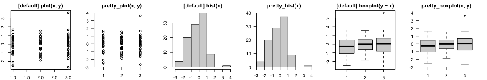

# prettyGraphics

[](https://www.repostatus.org/#active)

`prettyGraphics` is an R package designed to make the production of
plots and data exploration easier, more flexible and prettier.
`prettyGraphics` has been particularly inspired by the requirements of
continuous ecological datasets. The package includes multiple ‘building
block’ functions which help to define the initial arguments of a plot
and then add elements to a plot in sequence. Some integrative functions
draw on the flexibility of building blocks to define prettier plots for
a variety of equivalent plotting functions in base R
(e.g. `graphics::plot()`, `graphics::hist()` and more) or more
specialised routines. Key functionality includes:

  - The definition of pretty axes for plots.
  - Tools to aid data exploration, including colouring lines by
    covariates and adding shading to elucidate relationships between
    several variables.
  - Tools to aid statistical inference, including adding statistical
    summaries to reveal patterns and adding model predictions to plots
    to compare observations with model predictions.
  - Integrative functions which create prettier versions of common plots
    more easily and facilitate visualisation of spatiotemporal data.
  - The definition of pretty plot layouts.

## Installation

You can install the development version of `prettyGraphics` from
[GitHub](https://github.com) with:

``` r
devtools::install_github("edwardlavender/prettyGraphics", build_vignette = TRUE)
```

If you build the vignette, you can view this with
`vignette("introducing_prettyGraphics", package = "prettyGraphics")`.
The package can then be loaded and attached with:

``` r
library(prettyGraphics)
```

## The definition of pretty axes

  - `pretty_seq()` defines defines pretty sequences, given data, limits
    and pretty parameters;
  - `pretty_axis()` is a very flexible function which is used to define
    and add pretty axes to plots (i.e., axes with intelligible tick mark
    labels that are positioned in appropriate, adjoining positions,
    rather than as an approximate box around a plot);
  - `sci_notation()` translates the ‘e’ notation used by base R into
    scientific notation;
  - `add_lagging_point_zero()` brings all numbers up to the same number
    of decimal places;
  - `add_grid_xy_rect()` adds a rectangular grid to a plot at
    user-defined positions;

## Data exploration

  - `add_lines()` adds a line to a plot illustrating a relationship
    between y and x that can be coloured by the values of a third
    variable;
  - `add_colour_bar()` adds a customisable colour bar legend to a plot;
  - `add_shading_bar()` adds blocks of shading to a plot to elucidate
    relationships between a response and explanatory variables, one of
    which is a factor;
  - `add_shading_quantiles()` adds shading for the quantiles of observed
    variation to a plot;
  - `add_boundary_box()` adds a boundary box around observations at
    specified coordinates;

## Statistical inference

  - `summarise_in_bins()` computes statistical summaries of continuous
    data in bins, which can be added to plots using `add_lines()`;
  - `add_error_bars()` adds error bars to a plot;
  - `list_CIs()` lists model predictions/confidence intervals from
    fitted values and standard errors (or similar);
  - `add_model_predictions()` adds model predictions (e.g. fitted lines,
    confidence intervals) to plots;
  - `pretty_smooth_1d()` plots pretty one dimensional smooths estimated
    by `mgcv::gam()`;

## Standard plotting functions

  - `pretty_plot()` creates prettier plots for a variety of functions;
  - `pretty_hist()` creates prettier histograms;
  - `pretty_boxplot()` creates prettier boxplots;
  - `pretty_curve()` evaluates and plots functions;
  - `pretty_mat()` creates pretty matrices;
  - `pretty_residuals()` creates prettier diagnostic residual plots
    (including standard diagnostic plots alongside residuals against
    covariates, timestamps and the autocorrelation function, if
    applicable);

Here are some simple examples in which the default `graphics` and
`prettyGraphics` plots are compared:

``` r
# Simulate some data 
n <- 100
x <- factor(sample(1:3, n, replace = TRUE))
y <- stats::rnorm(n, 0, 1)
# Compare graphics and prettyGraphics defaults for some example plots 
pp <- par(mfrow = c(1, 6), mar = c(2, 2, 2, 2))
plot.default(x, y, main = "[default] plot(x, y)")
pretty_plot(x, y, main = "pretty_plot(x, y)")
hist(y, main = "[default] hist(x)")
pretty_hist(y, main = "pretty_hist(x)")
boxplot(y ~ x, main = "[default] boxplot(y ~ x)")
pretty_boxplot(x, y, main = "pretty_boxplot(x, y)")
```



``` r
par(pp)
```

## Temporal data

  - `pretty_line()` creates pretty number lines and timelines;
  - `define_time_blocks()` defines time blocks (i.e., diel periods or
    seasons) for each day in a time window (designed to work with
    `add_shading_bar()`);
  - `pretty_ts()` creates pretty timeseries plots;
  - `pretty_ts_mat()` creates 2-dimensional plots of the within and
    between day variation in a timeseries;
  - `pretty_pgram()` creates processed periodogram plots (power
    spectra);
  - `vis_ts()` is an R Shiny-Dashboard user interface for the
    interactive exploration of (ecological) timeseries and creation of
    publication quality plots;
  - `add_moons()` adds moons to a plot of lunar phase;

## Spatial data

  - `pretty_scape_3d()` and `vis_scape_3d()` produce interactive,
    3-dimensional visualisations of landscapes/seascapes and/or
    environmental conditions; for large rasters, `crop_aggr_utm()` helps
    reduce raster dimensions for these functions;

## Plot layout

  - `par_mf()` defines a suitable plotting window for a given number of
    plots;
  - `par_tri()` defines the indices of plots along the lower or upper
    triangle of a square multi-panel matrix;

## Future functionality

Possible future functionality includes:

  - `pretty_barplot()` for prettier barplots;
  - `pretty_raster()` and `pretty_poly()` for spatial data;
  - `add_hydrodynamic_ts()` to add hydrodynamic model predictions to
    (depth) timeseries;

## Disclaimer

`prettyGraphics` is a new package whose contents are an early stage of
evolution and primarily driven by the author’s ecological research.
Please report issues, comments and suggestions\!
